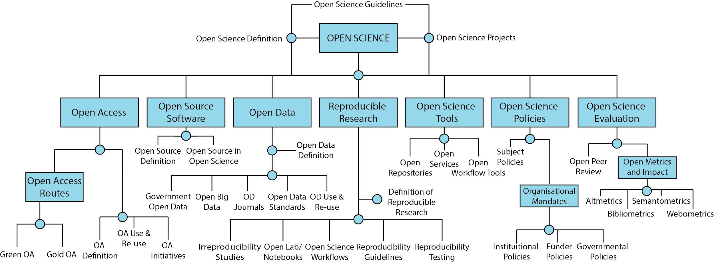

<meta charset="utf-8"> 

#### Version information

- Version 1.0 | October 16, 2017 - Started document.
- Version 1.1 | June 06, 2018 - Created website.
- Version 1.2 | IN PREP - Completed first draft (target: July 30, 2018)

### Table of Contents

* [Purpose of this Document](#Purpose)
* [Strategy](#Strategy)
  * [Short-term strategy, >2 years](#Short)
  * [Mid-term strategy, 2-5 years](#Middle)
  * [Long-term strategy, 5+ years](#Long)
* [What is Open Scholarship?](#What_is)
* [State of the Movement](#State)
* [Top Strategic Priorities for Open Scholarship](#Priorities)
  * [Democratization](#Democratization)
  * [Pragmatism and transparency](#Pragmatism)
  * [Infrastructure](#Infrastucture)
  * [Public good](#Public)
  * [Measurement](#Measurement)
  * [Community and inclusion](#Community)
* [Movement Strengths](#Strengths)
* [Movement Challenges](#Challenges)
  * [External conditions](#External)
  * [Internal conditions](#Internal)
* [Opportunities](#Opportunities)
* [Threats](#Threats)

**Important Note** This project is currently in development and available for contributions on [GitHub](https://github.com/Open-Scholarship-Strategy/site). Please see the [README](https://github.com/Open-Scholarship-Strategy/site/blob/master/README.md) file for more detail, and the main content file is [here](https://github.com/Open-Scholarship-Strategy/site/blob/master/index.Rmd).

*Note 2: The final version will be available as this website, a PDF (archived in Zenodo), raw markdown format, and iPython notebook.*

**Drafting Committee**: [Jonathan Tennant](https://orcid.org/0000-0001-7794-0218)*, Jonathan Dugan, Rachel Harding, Tony Ross-Hellauer, [Kshitiz Khanal]( https://orcid.org/0000-0002-4765-4832), [Thomas Pasquier](https://orcid.org/0000-0001-6876-1306), Jeroen Bosman, [Asura Enkhbayar](https://orcid.org/0000-0002-3934-026X), Gail Clement, [David Eccles](https://orcid.org/0000-0003-4634-4995), [Fiona Bradley](https://orcid.org/0000-0002-3622-2794), ([Bjoern Brembs]( http://orcid.org/0000-0001-7824-7650)), (Pawel Szczesny), Lisa Matthias, [Jesper Norgaard Kjaer](http://orcid.org/0000-0001-9183-9861), [Daniel S. Katz](http://orcid.org/0000-0001-5934-7525), [Tom Crick](https://orcid.org/0000-0001-5196-9389), [Christopher R. Madan](https://orcid.org/0000-0003-3228-6501), [Paul Macklin](https://orcid.org/0000-0002-9925-0151), [Johanna Havemann](https://orcid.org/0000-0002-6157-1494), [Jennifer E. Beamer](https://orcid.org/0000-0001-6887-6568), [Michael Schulte-Mecklenbeck](https://orcid.org/0000-0002-0406-8809), Dan Sholler, Paola Masuzzo, [Tobias Steiner](https://orcid.org/0000-0002-3158-3136), [Tim Koder](https://orcid.org/0000-0001-6152-7365), [David Nichols](https://orcid.org/0000-0003-0321-7267), [Daniel Graziotin](https://orcid.org/0000-0002-9107-7681), Alastair Dunning, [Andy Turner](http://orcid.org/0000-0002-6098-6313), [Neo Christopher Chung](https://orcid.org/0000-0001-6798-8867)

*[Contact](mailto:jon.tennant.2@gmail.com)

# 1. Purpose of this Document 

**This document aims to agree on a broad, international strategy for the implementation of open scholarship that meets the needs of different national and regional communities but works globally.**

Scholarly research can be an inspirational process for advancing our collective knowledge to the benefit of all humankind. However, current research practices often struggle with a range of tensions and conflicts as it adapts to a largely digital system. What is broadly termed as *Open Scholarship* is an attempt to realign modern research practices with this ideal. We do not propose a definition of Open Scholarship, but recognise that it is a holistic term that encompasses many disciplines, practices, and principles, sometimes also referred to as Open Science or Open Research. We choose the term Open Scholarship to be more inclusive of these other terms.

The purpose of this document is to provide a concise analysis of where the global Open Scholarship movement currently stands: what the common threads and strengths are, where the greatest opportunities and challenges lie, and how we can more effectively work together as a global community to recognise the top strategic priorities. This document was inspired by the [Foundations for OER Strategy Development](http://www.oerstrategy.org/home/read-the-doc/) and work in the [FORCE11 Scholarly Commons Working Group](https://www.force11.org/group/scholarly-commons-working-group), and developed by an open contribution working group.

Our hope is that this document will serve as a foundational resource for continuing discussions and initiatives about implementing effective strategies to help streamline the integration of Open Scholarship practices into a modern, digital research culture. Through this, we hope to extend the reach and impact of Open Scholarship into a global context, making sure that it is truly *open for all*. We also hope that this document will evolve as the conversations around Open Scholarship progress, and help to provide useful insight for both global co-ordination and local action. We believe this is a step forward in making Open Scholarship the norm.

Ultimately, we expect the impact of widespread adoption of Open Scholarship to be diverse. We expect novel research practices to increase the pace of innovation, and therefore stimulate critical industries around the world. We could also expect to see an increase in public trust of science, as transparency becomes more normative. As such, we expect interest in Open Scholarship to increase at multiple levels, due to its inherent influence on society and global economics.

# 2. Strategy 

"*[Strategy](https://en.wikipedia.org/wiki/Strategy) generally involves setting goals, determining actions to achieve the **goals**, and mobilizing resources to execute the actions. A strategy describes how the ends (goals) will be achieved by the means (resources).*"

In order to overcome the challenges and achieve our priorities, we need to build on our strengths. We have identified three main temporal components (short-, mid-, and long-term) of our overall strategy to be used as direct suggestions for action on the individual, group, institutional or national (or higher) level. 

We note that, due to the diversity of actors and stakeholders and their views and practices, this strategy is not a consensus document. How the different aspects are prioritised is a matter of debate based on varying perspectives. Its effectiveness will be realised when individuals and communities can implement different parts of it as cultural norms develop and shift towards a more open state. Indeed, many view the progress of Open Scholarship in the last 2-3 decades as painfully insubstantive, a factor which might reflect its general lack of strategic thinking and implementation.

We also note that this strategy can only be based on information which we as a collective have, and it remains highly likely that there are many initiatives, policies and programs that we have inadvertently missed. As such, it is probable that there are strategies that we have missed or not even considered. Nonetheless, we have attempted to justify our strategy where possible using evidence and reasoning, the discussion of which can be found below the strategy in Section 5.

## 2.1 Short-term strategy (>2 years) 

**Individual Level**

* Advocate for funding organisations, governments and research institutions to adopt policies and mandates related to Open Scholarship practices beyond Open Access (OA) and data sharing; for example, on open peer review, use of persistent identifiers (PIDs), open research evaluation, and preprints.

* Make contributions of an individual to openness visible in public (e.g., on a CV, open platform, or personal website).

* Adopt a broad-scale approach to the variety of open scholarly research and education practices. See the [FOSTER Open Science taxonomy](https://www.fosteropenscience.eu/resources) for guidance.

* Adopt the use of open source and free software for the conduct of research and analysis so that the computational processing can be audited by the community, and so that the tools used are available to everyone to increase productivity and collaboration.

* Commit to a variety of personal Open Scholarship practices, such as sharing research data and materials in free, openly-licensed formats so that methods and results can be freely examined and built upon by the wider community.

* Commit to sharing preprints for the open and rapid dissemination of your work.

* Establish support structures (e.g., openLab, walk-in labs, makerspaces in the wider sense) that help to guide other individuals along the path towards Open Scholarship. This can include questions of how to publish, teach, learn and do research in the open, and what tools are available to use for these (Figures 1 and 2).

\

[Kramer, Bianca, & Bosman, Jeroen. (2018, January). Rainbow of open science practices. Zenodo](http://doi.org/10.5281/zenodo.1147025).

\

[Steiner, Tobias. Open Educational Practice (OEP): collection of scenarios. (2018, February). Zenodo](https://zenodo.org/record/1183806).

 
* Form better relationships with other stakeholders involved in Open Scholarship developments (e.g., librarians, policymakers, publishers and other service providers, Open Access advocates, and those actively teaching in education).

* Work for, and collaborate with, researchers who practice various aspects of Open Scholarship, ranging from developing Open Source software and tools to posting preprints and citizen science.

* Encourage the wider adoption of an open mindset that emphasises the importance of the research process over the outcome.

* Sign the San Francisco Declaration on Research Assessment [(DORA)](https://sfdora.org/) as a commitment to improving how research is assessed. Make sure to adhere to the principles too in practice.

  * As an alternative, adopt the [Leiden Manifesto](http://www.leidenmanifesto.org/).
 
* Refuse to sign copyright transfer agreements, unless you are allowed to retain copyright of your work under a [Creative Commons](https://creativecommons.org/) license of your own choosing.

**Group Level (e.g., labs, departments)**

* Locate Open Scholarship hotspots (i.e., venues or groups for regular exchange and discussion about community building) and find a way to link them together to help community cohesion and expansion. 

  * If a local one does not yet exist, establish it (e.g., using the [Meetup](https://www.meetup.com/) platform).

* Establish rights experts who might help with questions regarding copyright issues and the effective use of Creative Commons licenses.

* Highlight best practice showcases in order to demonstrate what is actually possible with Open Scholarship, and what the wider advantages can be.

* Adopt best practices for Open Scholarship, including shared data as a research output, addressing publication bias, and "questionable research practices" with bias-reducing workflows.

* Advocate to decision makers at scholarly journals, publishers, funders, and higher education and research institutes to recognize and reward a variety of Open Scholarship activities, particularly regarding research evaluation policies.

* Start discussions with University Ranking Providers (e.g., QS, Times Higher Education) to include an openness element to their indicators. 

* Initiate debates on meaningful standards and practices at a disciplinary level for publishing data (e.g., the [FAIR principles](https://www.go-fair.org/fair-principles/)).

* Improve engagement between faculty advisory boards, researchers, students and librarians regarding Open Scholarship practices and principles.

* Refuse to engage with publishers who have restrictive preprint, Open Access, and copyright policies.

**Institute Level (including research and funding bodies)**

* Research libraries should collect information about how the sector as a whole interacts with the research literature. Such information could be used to help with publisher negotiations, break up big deal contracts, and cancel subscriptions by providing evidence into the cross-sectorial value of services, and includes: 

  * Which venues researchers are publishing in;

  * Who is doing the editorial and peer review work;

  * How much is being spent on serial subscriptions; 

  * How much is being spent on Article Processing Charges (APCs) for Open Access; and 

  * Which articles are being downloaded and cited.

* Map and coordinate when current subscription and big deal licenses will run out across research institutes, and let it happen. Where cancellations or terminations occur, ensure that there is adequate post-subscription access and support using existing sustainable and legal mechanisms (e.g., Inter-Library Loan). Explore routes for reinvesting money saved for library budgets.

* Purchase back any legacy documents and incorporate them into the scholarly body of work. Also improve the open sharing and archiving of legacy articles on which copyright has expired. 
  
  * Help to inform researchers more about the [Author Alliance termination of transfer](https://www.authorsalliance.org/resources/termination-of-transfer/) tool to help them retain their rights as authors.

* Research funders can define the limits of what is an acceptable standard of publication. They therefore have the power to mandate publication in journals with a cap on APCs, or in OA-only venues (with specific licenses), or in those with short or zero-length embargoes on self-archiving (e.g., Emerald, The Royal Society).

* Refuse to engage with publishers that [double dip](http://www.rluk.ac.uk/about-us/blog/the-costs-of-double-dipping/) on payments, and demand transparency and data in cases where there is a suspicion that this is occurring. 

* Refuse to engage with publishers in which there is no transparency around pricing for either subscriptions or Open Access. This includes with publishers who insist on using non-disclosure agreements as part of licensing contract terms.

  * Engage publishers on being more transparent about the financial aspects of their publishing workflows, similar to those such as [Ubiquity Press](https://www.ubiquitypress.com/site/publish/).

* Insist that publishers make all bibliographic records, usage metrics, and citation data freely available and accessible in both a human- and machine-readable format.

* Development of rights retention policies for scholarly research at research institutes that currently lack them.

* Adoption of the [CASRAI CRediT](http://docs.casrai.org/CRediT) (Contributor Rules Taxonomy) guidelines to help identify author contributions more clearly.

* Refuse to engage with publishers who have restrictive preprint, Open Access, and copyright policies.

* Encourage further adoption by publishers of the [Initiative for Open Citations](https://i4oc.org/) (I4OC) in conjunction with the wider uptake of open standards.

* For research institutes that currently lack them, either launch and maintain an Open Access repository or find an existing resource to use, and adopt an [Open Access policy](https://cyber.harvard.edu/hoap/Good_practices_for_university_open-access_policies). Make these easily discoverable and accessible on the institutional website, and any relevant indexing services.

* Promote and compensate time and effort spent on training and advocacy for the various aspects of Open Scholarship, including Open Source, Open Access, and Open Education.

* Engage with research communities to develop and advertise quantifiable incentives for sharing preprints, open data, reproducible analyses, and OA in hiring, promotion, and tenure decisions. Define new ways of describing these wider contributions to scientific communities.

* Encourage and adopt the principles for fairer research assessment outlined in DORA. Make sure that those in charge of research assessment, including hiring, tenure, and grant-awarding committees adhere to these.

**National Level (or higher)**

* Create new or support/contact existing international library consortia/collaborations (e.g., the [International Coalition of Library Consortia](http://icolc.net/)) to co-operate on infrastructure developments (e.g., [LIBER](http://libereurope.eu/), [EIFL](http://www.eifl.net/), [ARL](http://www.arl.org/), and [SPARC](https://sparcopen.org/)).

  * Sign on to the Global Sustainability Coailition for Open Science Services [(SCOSS)](http://scoss.org/).

  * Consortia like the German [Projekt DEAL](https://www.projekt-deal.de/) could provide examples of how to take the first step towards this at a national level. Gaining support from SPARC for any such developments would also be useful.

* Build on faculty and funder support for Open Access and related quality assurance initiatives (e.g., peer review) that are decoupled from journals. Agree on, and develop, a governance structure for a world-wide scholarly infrastructure (e.g., [W3C](https://www.w3.org/)).

* Create scholarly standards to implement an alternative non-profit and community-owned scholarly publishing platform/environment (using the funds freed from subscriptions, building on existing repositories/environments and infrastructure). 

* Support collaborations such as [Metadata 2020](http://www.metadata2020.org/), [NISO](http://www.niso.org/)/[NIST](https://www.nist.gov/), and [eLife](https://elifesciences.org/), to help build a richer connectivity between scholarly communication systems and communities.

* Take action against the privatisation of scholarly works and processes in order to achieve transformation of the publishing industry into one comprised of fair licensing, fair market competition, and under the ownership of the scholarly community.

* Create a cost-effectiveness analysis of Open Scholarship (e.g., true cost of article publishing) to be used as the basis for an argument about how much taxpayer money it costs every year to delay decisions in the above areas.

* Implement currently available sort, filter and search/discovery technology across scholarship outputs.

  * Enable unrestricted text and data mining over this content.

* Research funders and libraries hold most of the purse strings, and further engagement on this front is essential, especially in defining their relative roles in developing or funding scholarly infrastructure. Simply channelling more money into the existing system, with perverse incentives and skewed power dynamics, is clearly no longer sustainable for research.

  * Develop sustainable, national roadmaps for Open Scholarship.

* Encourage research funders to diversify the portfolio of what is considered as a research output for assessment purposes. 

  * Wider adoption of preprint and Open Access policies similar to those at the NIH (USA) and Wellcome Trust (UK).

* A reduction of article-processing charges (APCs) in hybrid titles to match the market average for OA-only journals.

  * The scholarly publishing market might require a detailed government-level investigation in order to stabilise this.

* Mandating [ORCID](http://orcid.org/) for researchers across all research outputs to help assist in the persistent identification of authors across the entire research literature, and easier research discoverability.

* Where subscriptions have not yet expired, mandating offsetting agreements for hybrid journal titles in order to reduce double-dipping. 

  * Where offsetting deals are in place, these can be streamlined and standardised across sectors to reduce administrative burden.

* For scholarly publishers to engage with the new [UK Scholarly Communications License](http://ukscl.ac.uk/) that enables authors to retain more of their rights. This would reduce the time spent on embargo processing, the cost spent on hybrid APCs, and for researchers in the UK, help them to comply with the [UKRI Open Access policy](https://www.ukri.org/funding/information-for-award-holders/open-access/open-access-policy/). 

  * For those outside of the UK to consider extending the UK SCL (or relevant variations of it) towards other regional funding and licensing strategies.

* Sector-wide adoption of no-questions-asked fee waiver policies for researchers from lower- to middle-income countries, or those with a demonstrable financial need.

* To [transform](https://dash.harvard.edu/handle/1/27803834) (or flip) the majority of scholarly journals from subscription to Open Access publishing in accordance with community-specific publication preferences.

* To invite all [relevant stakeholders](https://content.iospress.com/articles/information-services-and-use/isu839), including universities, research institutions, learned societies, funders, libraries, and publishers, to collaborate on a transition to open research practices for the benefit of scholarship and society at large.

* Create showcases/highlights/good practices of Open Scholarship practices on national websites or portals, together with relevant information and resources.

  * Encourage the formalisation of Open Science Training Courses, such as that offered by [FOSTER](https://www.fosteropenscience.eu/toolkit), in graduate school training programs (and further).

* Encourage and adopt the principles for fairer research assessment outlined in DORA. Make sure that those in charge of research assessment, including hiring, tenure, and grant-awarding committees adhere to these.

## 2.2 Mid-term strategy (2-5 years) 

The expectation at this point is that specific parts of the short-term strategy will have been initiated, based on the needs of respective groups, and are either in place or in development. Often, these are ongoing processes, and therefore might overlap with the mid-term strategy, and are not worth repeating here. However, all of the items mentioned in the [short-term strategy](#Short) are still relevant at this stage, depending on the pace of development.

**Individual Level**

* Continue instructing new researchers in best practices regarding Open Scholarship.
  
  * In areas where this might be lacking, build strategic community networks to increase the strength of advocacy efforts.

* Ensure that all of ones research processes and outputs, including historical ones, are openly licensed and available for re-use in appropriate venues.

* Develop workflows that take advantage of Open Scholarship practices to demonstrate their increased effectiveness in comparison to traditional, more closed workflows.

* Continue to innovate in new research processes and workflows as new services, outlets, and technologies become available.

* Continue to develop the aspects of the Short-term strategy (Section 2.1).

**Group Level**

* Create a comprehensive set of mechanisms that allow fully open research processes to public participation (no more piggybacking, no more "human processing units", etc.).

* Develop Open Scholarship workflows for all group members to take advantage of increasingly well-developed open scholarly infrastructure and tools.

  * Ensure that group members are trained in a wide variety of relevant skills, including public engagement, policy development, data analysis, Web development, and citizen science. 

* Showcase developments and success stories from Open Scholarship practices.

* Continue to build and empower local Open Scholarship communities, including newer researchers and students.

* Continue to develop the aspects of the Short-term strategy (Section 2.1).

**Institute Level**

* Implement opt-out automatization of manuscript handling/single-click submission to an open repository under default open licenses.

  * Implement opt-out automatization of data deposition under default open licenses.

  * Implement opt-out automatization of code accessibility and version control under default open licenses.

* To convert saved resources currently spent on journal subscriptions into funds supporting sustainable Open Access business models, scholarly infrastructure, and other relevant support services.

* Develop and teach courses on the various practices of Open Scholarship (e.g., as required seminars/workshops for graduate school programs).

* Continue working with other research institutes to share resources, infrastructure, and services in a more sustainable manner.

* Research funders to have explicit and enforced mandates regarding Open Scholarship, making sure not to impinge upon academic freedoms.

* Continue to only engage with publishers and other vendors that have progressively open services, tools, and policies in place.

* Commit to openly sharing institute-level data and metrics on research activities, records and behaviour. 

* Continue to ensure that research assessment policies are evidence-informed, rigorous, and adhered to at all levels.

**National (or higher) Level**

* Start implementing semantic technology across all scholarship outputs, including for the purposes of enabling unrestricted text and data mining.

* Formulation of recommended career metrics that incentivize Open Data publication, Open Source software release, and research support.

  * Ensure that fairer and more rigorous research assessment policies are in place, and well-supported and monitored.

* For any remaining hybrid journals that attain a higher proportion of Open Access over subscription articles, encourage them to flip them to pure Open Access with an APC that reflects the running costs of the journal.

  * For remaining hybrid journals that have not attained this level, refuse to support publication of Open Access articles in those venues, and also refuse to renew subscriptions.

* Increase funding for outreach, especially to under-represented demographics.

* Engage library consortia (e.g., LIBER, EIFL) with national negotiation consortia, and any relevant higher education unions, in order to strengthen researcher coalitions. Supplement these with scholarly collaborations (e.g., eLife, NISO) in order to further develop relationships and collaborations across the scholarly communication sector.

* Begin implementation of national or international scholarly infrastructures, with cross-stakeholder agreed upon open standards, roadmaps, and governance structures. Ensure this is supported with sustainable funding streams diverted from refreshed library budgets after expensive publishing contracts have been terminated or expired.

* Publicise the outcomes of any research or investigations into the status of national-level scholarly publishing markets.

## 2.3 Long-term strategy (5-10 years) 

The expectation at this point is that specific parts of the short- and mid-term strategies will have been initiated, based on the needs of respective groups, and are either in place or in development. Often, these are ongoing processes, and therefore might overlap with the long-term strategy, and are not worth repeating here. However, all of the items mentioned in the [short-term strategy](#Short) and [mid-term strategy](#Middle) are still relevant at this stage, depending on the pace of development.

**Individual Level**

* Support the formal training of junior researchers in the usage and best practices of newly developed scholarly infrastructure tools and services.

* Teach students about open lab notebooks, version control, continuous analysis, and other aspects of Open Scholarship processes in introductory research courses.

* Develop training material (OER) for further Open Scholarship development.

* Continue to link Open Scholarship communities together to foster increased inter-disciplinary engagement and collaboration.

* Continue developing elements of the Short- and Mid-term strategies.

**Group Level**

* Continue development of and experimentation with emerging and established Open Scholarship workflows, integrating elements of newly established scholarly infrastructures.

* Communicate the advantages or impact of adopting Open Scholarship workflows to other groups, and formalised training in these.

* Continue developing elements of the Short- and Mid-term strategies.

**Institute Level**

* Establish a permanent fund to be used towards more sustainable ventures, including Open Source software development, APCs, preprint servers, and other costs related to Open Scholarship.

* Incentivize and mandate all research outputs to be published in Open Access journals or platforms.

* Incentivize junior scholars to practice openness in their research.

* Continue developing elements of the Short- and Mid-term strategies.

**National (or higher) Level**

* Develop innovative solutions and functionalities that do not exist today.

* Require government-funded research to be published in Open Access journals or other Open platforms or repositories. Apply penalties for those who do not conform to the mandate.

* Eliminate the "publish or perish" pressure by focusing on more diverse research outputs and processes for evaluation and assessment criteria.

* Help researchers to take control of the research and evaluation processes based on what they believe will contribute most to scientific progress.

# 3. What is Open Scholarship? 

For more than two decades, the movement for Open Scholarship has evolved from a collection of small, localized efforts to a broad international network of institutions, organizations, governments, practitioners, advocates, and funders. While significant progress has been made on both expanding the understanding and practice of Open Scholarship (e.g., [Peters et al., 2012](https://www.routledge.com/Virtues-of-Openness-Education-Science-and-Scholarship-in-the-Digital/Peters-Roberts/p/book/9781594516863)) [Friesike et al.](https://link.springer.com/article/10.1007/s10961-014-9375-6)[, 2013](https://link.springer.com/article/10.1007/s10961-014-9375-6); [Munafo](https://www.nature.com/articles/s41562-016-0021)[et al., 2017](https://www.nature.com/articles/s41562-016-0021)), Open Scholarship practices and values are not yet the norm in most research disciplines and adoption is spread [unevenly around the world](http://knowledgegap.org/index.php/sub-projects/knowledge-and-power-inequality-in-open-science-policies/). 

**In this document we consider the term "Open Scholarship" to broadly refer to the process, communication, and re-use of research as practised in any scholarly research discipline, and its inclusion and role within wider society.**

The goals and broader vision for Open Scholarship are outlined in foundational documents including the [Budapest Open Access Initiative](http://www.budapestopenaccessinitiative.org/), The [Open Archives Initiative](https://www.openarchives.org/), [Vienna Principles](http://viennaprinciples.org/), [Scholarly Commons principles](https://www.force11.org/scholarly-commons/principles), and The [Panton Principles](https://en.wikipedia.org/wiki/Panton_Principles). Throughout time, there have been dozens of [declarations](http://oad.simmons.edu/oadwiki/Declarations_in_support_of_OA), [charters](https://docs.google.com/spreadsheets/d/1-aRXFiRg-VL9hpLpxoJqX6-OC-A0R2oCogHfIx52Nug/edit#gid=956616118), and statements about the priorities of the various aspects of Open Scholarship. The result of this is that there are now numerous competing, parallel, or overlapping definitions of what Open Scholarship comprises in terms of both research principles and practice, which aim to encapsulate the movement towards fostering scientific growth alongside public accessibility. 

Herein, we find it useful to consider Open Scholarship to be analogous to a boundary object, in that it is flexibly adaptive, interpreted differently across communities but with enough immutable content to maintain its integrity. We find [Fecher and Friesike (2013)](https://link.springer.com/chapter/10.1007%2F978-3-319-00026-8_2) five "schools of thought" to be particularly useful in framing this strategy, based on the components: Infrastructure, Measurement, Public, Democratic and Pragmatic. Furthermore, we now extend this to suggest a sixth school of Community and Inclusion, based on developments in this space in the last 5 years (and more). The OCSD (Open and Collaborative Science in Development) Network has an [Open Science Manifesto](https://ocsdnet.org/manifesto/open-science-manifesto/) for a more inclusive Open Science for social and environmental well-being that is also highly useful in framing for this strategy.

These previous works have been, and remain to be, crucial for building a central identity for the global Open Scholarship community, communicating the case for Open Scholarship to wider society, and providing a basis to push the global movement forward. To realize the full potential and vision of Open Scholarship, we believe that a document is needed that asks critical questions about the internal structure of Open Scholarship as a movement, and addresses strategic questions about how we, as a global movement, can identify concrete steps to achieving these goals. For those unfamiliar with the language of Open Scholarship, we refer them to the [Open Research Glossary](http://www.righttoresearch.org/resources/openresearchglossary/), hosted by the Right to Research Coalition.

\

[Fecher and Frieseke (2013), Five schools of thought in Open Scholarship](https://www.fosteropenscience.eu/content/what-open-science-introduction)).

# 4. State of the Movement 

A [movement](https://www.google.de/search?q=Dictionary#dobs=movement) can be defined as "a group of people working together to advance their shared political, social, or artistic ideas." Open Scholarship supporters are an enormously diverse group of people, including non-academic citizens, activists, faculty and students at a range of academic or career levels as well as research institutes, scholarly publishers, librarians, policymakers, and Non-Governmental Organisations (NGOs). These community members come from countries around the globe and a range of socio-economic situations. As such, Open Scholarship has a range of different social, economic and cultural contexts, which these various communities and stakeholders are united under. While this diversity is a strength for the Open Scholarship movement by bringing a wide variety of perspectives, experiences, capacities, and resources, it also presents challenges for setting strategic directions, building shared plans, and governance and co-ordination structures. 

Perhaps the most widespread commonality between Open Scholarship stakeholders is the belief that increased adoption of Open Scholarship practices is generally a *good thing*, and that it would bring wider benefits to the research community, environment, global economies and wider society. Given this foundational common value, we can begin to identify the core challenges and opportunities in Open Scholarship to define strategic elements that can be adopted at different levels and by varying stakeholder groups. From this, we can gain a collective sense of priority as to the sorts of definitive actions that can be taken to help the advancement of Open Scholarship.

## 4.1 Shared Perspectives

### 4.1.1 General Value Proposition

**Open Scholarship makes research outputs and scholarly practices more accessible and inclusive, and expands our horizons on what is possible from the process of scholarly research.**

### 4.1.2 Overall goals and vision

Research practices and scholarly communications are constantly evolving. However, despite the fact that the Web was originally designed around 30 years ago to disrupt the hierarchical approach of information management by the decentralisation of scholarly communications ([Berners-Lee, 1989](https://www.w3.org/History/1989/proposal.html)), the pervasive spread of the Web has left much of the pre-existing scholarly publication model and industry fundamentally unchanged. Such a perceived slow rate of change or inertia can possibly be attributed to the wide range of diverse stakeholders engaged in this domain, and the deep entrenchment of interests and positions; for example, over copyright, journal brands, and research assessment. As such, one common perspective is that scholarly communication processes need to increasingly embrace the power of Web-native technologies in order to enhance networking, collaboration, and transparency in research. Alignment of this ideal with the process of research itself is what is broadly agreed on as Open Scholarship, and there has been an undeniable explosion in the rate of innovation in scholarly communication in this in the last 10 years. 

The primary vision here, and one which we are optimistic of achieving, is three-fold:

1. That all educational resources and research outputs, as a global societal common good should be accessible free of charge to all publics who wish to benefit from them. 
2. That the benefits of this research should be integrated into wider society.
3. That anyone should be freely available to contribute to, and participate in, this process.

### 4.1.3 Definition as a boundary object

Open Scholarship when perceived as a *boundary object* ([Star, 1989](http://www.lchc.ucsd.edu/MCA/Mail/xmcamail.2012_08.dir/pdfMrgHgzULhA.pdf)) allows us to balance different categories and meanings across many diverse communities of practice. Here, the creation and management of such boundary objects is a key process in developing and maintaining coherence across intersecting communities. 

Broadly, the core aspects of Open Scholarship can be divided into two major categories: **practices** and **principles**. For the former, this relates to aspects such as Open Access, Open Data, and Open Evaluation. The core principles of Open Scholarship include participation, equality, transparency, cognitive justice, collaboration, sharing, equity, and inclusivity; aspects that are often missing from traditional scholarship. Generally, it is agreed upon that the combination of these practices and principles will result in a better research process, all grouped under the broad heading of Open Scholarship. Indeed, [Watson (2015)](https://genomebiology.biomedcentral.com/articles/10.1186/s13059-015-0669-2) believes that these attributes are not exclusive to Open Scholarship, but should be key traits of good science in general. 

However, we acknowledge that Open Scholarship is not a simple construct to understand for many at the present, and often has its own language. We fully acknowledge that such a barrier must be overcome in order to maximise participation and engagement with both the principles and the practices ([Masuzzo and Martens, 2017](https://peerj.com/preprints/2689/)).

\

[Principles of Open Scholarship, by Tony Ross-Hellauer](https://www.slideshare.net/OpenAIRE_eu/peer-review-in-the-age-of-open-science), CC BY).

### 4.1.4 Open Scholarship ecosystem

Four major elements exist as preconditions to Open Scholarship adoption:

1. **Users**: Awareness of Open Scholarship to engage with the practices.

2. **Process**: Open Scholarship tools that guide adoption of practices.

3. **Context**: Community and systemic support to create a sustainable Open Scholarship environment.

4. **Incentives**: Motivations to engage with the practices.

\

Adapted from the [Foster Open Scholarship Taxonomy](https://www.fosteropenscience.eu/taxonomy/term/102) (CC BY 4.0). Please note that this is a non-exhaustive taxonomy of all possible aspects of Open Science.

## 4.2 Varied Perspectives

As well as these shared commonalities above, tensions also exist between the best way to adopt Open Scholarship practices. Open Scholarship is an agenda with multiple stakeholders, whose diverse cultures, backgrounds and interests mean that one-size-fits-all solutions could potentially harm local interests (or vice versa). On the other hand, there is a need to ensure that strategies are joined-up so that the actions of those with similar aims are not working at cross-purposes. Such "fault-lines" for the creation of a cohesive strategy are:

### 4.2.1 Geographic specificities

* Hundreds of individual [initiatives and organisations](http://oad.simmons.edu/oadwiki/Advocacy_organizations_for_OA) already exist to help provide and promote Open Access at different levels around the world.

* Thousands of individual [initiatives and organisations](https://oerworldmap.org/) already exist to help provide and promote Open Education at different levels around the world.

* High costs associated with Open Access publishing actively discriminate against researchers from Low and Middle Income Countries (LMICs).

* Many popular indexing services, such as Scopus and Web of Science, or explicitly biased against journals from developing countries, or those which do not have English as the primary language ([Mongeon and Paul-Hus, 2016](https://link.springer.com/article/10.1007/s11192-015-1765-5)).

* To ensure that any narrative of Open Science integrates the diverse worldviews, experiences, and challenges of Latin America, Asia, Africa and the Middle East, as outlined in the [Open and Collaborative Science Manifesto](https://ocsdnet.org/manifesto/open-science-manifesto/).

### 4.2.2 Disciplinary specificities

* As the more widely-used term Open Science contains the word Science, this can have an adverse effect of excluding researchers from the arts, humanities, engineering, mathematics, and other fields that might not be considered to be pure science. This problem seems mainly confined to native-English speaking researchers. Other terms such as e-Research and Digital Humanities describe similar practices across different communities.

* Differences in attitudes towards, and rates of uptake of, different Open practices. For example, many Open Scientific practices are geared towards empirical and quantitative research, and therefore require different evaluation and incentive structures than other scholarly disciplines.

* Accounting for domain-specific issues. For example, accounting for variation in biological supplies from different laboratory companies is a significant issue in reproducibility for biological research. Open Access books are a major problem in the Humanities ([Eve, 2014](https://www.martineve.com/images/uploads/2014/11/Eve_2014_Open-Access-and-the-Humanities.pdf)), but less so in STEM, and are often sidelined as an issue as a result.

* At the present there are few preprints from the [pharmaceutical industry](https://openpharma.blog/2017/08/14/when-will-preprints-take-off-in-medicine/), and none covering primary clinical data. There are at present considerable barriers to preprints of industry work, including the possibility of material that has not yet been peer-reviewed being seen as promotional, and the possibility of readers changing clinical practice based on material that has not yet been peer-reviewed, however well labelled a preprint is.

### 4.2.3 Stakeholder specificities

* Consider the range of stakeholders who have a direct interest in the development of Open Scholarship - Researchers, students, funders, librarians, research managers, scholarly societies, infrastructure providers, industry, wider society, publishers & other Open Scholarship service providers, educators, NGOs, and policymakers. Each of these groups engage in the Open Scholarship agenda for different reasons, and often these goals will be in conflict depending on their intrinsic motivations.

Regarding Open Access, there is little consensus on the best way forward for this at a multitude of scales (geographic, institutional, individual). The result of such ongoing tensions is, perhaps not surprisingly, the lack of well-defined strategic priorities for Open Access Conflicts between different stakeholder groups can often be distinguished based on competing interests, which filter through at multiple levels in communication, policy, and practices. 

The result of this is that the relationship network of stakeholders engaged in scholarly communication, and in particular developments in Open Scholarship, is particularly complex. Some of the most highly debated points include:

* Appropriate licensing schemes for research data;
* Where funding for scholarly publishing activites should come from;
* Who should be in charge of scholarly research infrastructure;
* What the optimal model of Open Access should be, and what the traits of this are;
* The role of charities, non-profit, and for-profit players; and
* How to resolve conflicts between different stakeholders.

This is a non-exhaustive list, but highlights that conflict resolution in scholarly communication can come in a range of flavours, based around key issues such as academic freedom, governance structures, and financing.

## 4.3 Extent of Open Scholarship adoption to consider the movement successful

There are varied opinions, and a lack of consensus, around what extent of Open Scholarship adoption is necessary to constitute success. Part of this is due to the lack of well-defined objectives, which means that defining a pathway with clear cut stepping stones has been difficult, and remained clouded by the different competing stakeholders and multiplicity of complex processes.

However, some aspects are clear, which can be generally agreed upon by all stakeholders: 

* Transforming the present scholarly communications market so that it flips to Open Scholarship services as the default model for research processes and outputs.

* Shifting public funding models to pay for the dissemination of services and outputs, rather than individual copies/subscriptions of content.

* Providing sufficiently high quality and diversity of services to permit adequate choice for researchers.

* Mainstreaming Open Scholarship so that it competes with traditional processes, in terms of reach, uptake, and incentivisation and reward.

* Building a significant number of education, training and support systems based on Open Scholarship skills development.

* Replacing entire traditional research workflows by Open Scholarship methodologies.

* Measurably increasing quality of research and achievement that leads to greater career prospects, and social, academic, and economic growth and innovation.

* Adoption of complete Open Access by funding agencies; policies that explicitly allow use of preprints and other pre-publications in funding applications, as well as consideration of non-traditional research outputs.

# 5. Top Strategic Priorities for Open Scholarship 

Taking into account the strategic goals and success criteria listed above, it is possible to define several leading sub-domains of actions that need to be implemented in order to achieve them. While there is no apparent consensus on this from the Open Scholarship movement, or what the priority order is, there is a general agreement that all of these actions are, at least to some degree, important. 

These strategic sub-domains are adapted from [Fecher and Friesike (2013)](https://link.springer.com/chapter/10.1007%2F978-3-319-00026-8_2), and form the foundation for the full [**strategy**](#Strategy) outlined above.

## 5.1 Democratization 

Believing that there is an unequal distribution of access to knowledge, Open Scholarship is concerned with making scholarly knowledge (including publications, code, methods, and data) accessible and available freely for everyone with access to modern technology (e.g., a computer and Internet connection). This is especially the case for publicly-funded research.

Importantly, democracy in Open Scholarship means not only equal access to knowledge, but also equal possibilities to contribute to knowledge and equal rights to participate in the world-wide community's decisions that affect knowledge creation and distribution. The latter means that Open Scholarship is antithetical to closed power clubs which are limited to a small number of participants deciding for the whole international community, whether such closed clubs are supported by institutional/governmental funders or are bottom-up organisations (e.g., small groups of prestigious authors). 

Indeed, it is quite unlikely that more than 10 million scientists, highly educated and intelligent, would agree with some rules created for them by a small number of people (or even worse, by some groups with financial interest). A more likely scenario is that the new rules governing Open Scholarship will appear in the open debate, through many collective projects, just like how this strategy was formed through collective editing. Several specific mechanisms have been proposed to realise democratic values in Open Scholarship in a decentralised way, including peer-to-peer and blockchain-based mechanisms. 

In working towards principles of Open Scholarship, we acknowledge that there is the potential for complexity, or even conflict in our objectives as policies and working practices evolve. Awareness of the broader research, industry and education landscape will help to position Open Scholarship to have the greatest possible impact, and to mitigate the potential of other policies and priorities to limit its potential. For example, copyright proposals in the EU that would limit who is permitted to undertake TDM (text and data mining), or policies promoting intellectual property (IP) and commercialisation should be balanced with policies that permit a wide range of uses of data, research, and knowledge.

Other specific aspects include:

* [Open Access](bit.ly/oa-book) publishing that allows not only free to read access but also free to reuse and free to distribute to the widest possible extent. Many believe that access to scientific knowledge is a fundamental human right.

  * One of the strongest arguments for Open Access is that publicly (or taxpayer) funded research should be accessible to the public. The increasing private sector funding of research is a difficult aspect to reconcile with this view at the present.

* Open Licences, licensing, and rights waivers for copyright that are understandable by both humans and machines. Typically, this has been administered through some combination of Creative Commons and Open Source licensing.

* Moving away from patenting.

  * One example of the open approach to patent management is "weak licensing - strong certification" - a situation especially easy to apply in medicine, where therapeutic devices or compounds are weakly licensed in terms of patents but the requirements for entering the market are set high from the regulator.

* Recognising the value of open source and open scholarship in accelerating innovation and research discovery (e.g., [Woelfle et al., 2011](https://www.nature.com/articles/nchem.1149); [Balasegaram et al., 2017](http://journals.plos.org/plosmedicine/article?id=10.1371/journal.pmed.1002276)).

* Changing publishing norms to make all objects within a research output to be concordant with the FAIR principles.

  * Making software and code readily available, re-usable, citable, and formally recognised as a research output, along with research articles, data, and metadata.
  
  * Wider use of data repositories and data journals for sharing research outputs, without restrictions from scholarly publishers. This enables data to be re-used by others in ways that are either foreseen or unforeseen by the original creators.
  
  * As one of the greatest difficulties for compliance with this is the amount of extra effort perceived in making work shareable in a compliant manner, automated or low-barrier methods of dissemination will be critical here.

* Research material repositories and the sharing of physical research outputs.

  * Research material sharing is critical for issues of reproducibility, reducing redundancy, and promoting open scientific collaboration. Issues were empirically examined by [Science Commons](http://sciencecommons.org/projects/licensing/empirical-data-about-materials-transfer/). 

  * Sharing well curated and annotated materials within communities without restrictive licensing or complex material transfer agreements which slow scientific progress due to complex legal jargon or stringent terms and conditions

  * Streamlined Material Transfer Agreements (MTAs) and Open Scholarship Trust Agreements (OSTAs) - legal agreement templates which may be easily amended for any researcher, irrespective of discipline, at any institution to simply share almost all categories of research materials they generate in the course of their research allowing efficient, open and collaborative scientific practices. Principles described herein "The core feature of trusts—holding property for the benefit of others is well suited to constructing a research community that treats reagents as public goods." [Edwards et al (2017)](http://stm.sciencemag.org/content/9/392/eaai9055.full?ijkey=uMGKxsCEiOb5s&keytype=ref&siteid=scitransmed).

  * E.g. OSTA template: [SGC](http://www.thesgc.org/click-trust) "click-trust" agreement E.g. MTA (Material Transfer Agreement) templates through [Science Commons](http://sciencecommons.org/projects/licensing/) 

* OER (Open Educational Resources). For more on this, see the [Foundations for OER Strategy Development](http://www.oerstrategy.org/home/read-the-doc/).

## 5.2 Pragmatism and transparency 

Following the principle that the creation of knowledge is made more efficient through collaboration and strengthened through critique, Open Scholarship seeks to harness network effects by connecting scholars and making scholarly processes at all levels transparent. Such optimisation can be achieved through modularising the process of knowledge creation, opening the scientific value chain, integrating external knowledge sources and collective intelligence, and facilitating collaboration through online tools and platforms. This sort of openness in the research process itself represents a paradigm shift from the traditional closed and independent nature of research.

Additional key aspects include:

* Making the process behind research should be as transparent as possible, and as closed as neccessary (for example, in order to protect sensitive data).

* Reproducibility ([Leek and Peng, 2015](http://www.pnas.org/content/112/6/1645); [Patil et al., 2016](https://www.biorxiv.org/content/early/2016/07/29/066803)), enhanced by increased transparency of research processes themselves, and not just outputs.
  
  * Includes core aspects such as open methodologies, acess to research tools for open work, as well as more transparent research workflows around preprints and open peer review.

  * This can help to resolve ongoing reproducibility crises in medicine, psychology, economics, and sociology.

  * Researchers should aim to automatically generate the results in a research paper through appropriately documented data and code. A range of Web 2.0 tools now exist to make this as simple as possible.
  
  * Replicability, to obtain the similar conclusions from new experiments, observations, and analyses based on a previously published manuscript.

* Sustainability of research through increased access to expertise, collaboration, knowledge aggregation, and enhanced productivity.

  * Being able to durably test results within a paper over time, which would include data archiving and software longevity and versioning.

  * Benefaction, by starting from and expanding someone workflow/codebase/tools, and avoiding unnecessary duplication of technical tasks.

* Adoption of the huge array of Web 2.0 technologies for communication and collaboration, which help to facilitate increasing demands for higher productivity and research complexity.

* Much of this is dependent on the willingness of researchers themselves to contribute to scholarly research in an open, collaborative, and collective manner, rather than a more personal approach.

  * Motivation for this is largely down to whether such researchers perceive this process as being advantageous to them in some way, for example getting a return on investment in social capital or prestige.
  
* Many tools to facilitate and accelerate scientific discovery, and enhance the research process already exist in some form.
  
  * This includes social networking sites, electronic laboratory notebooks, data archives, online collaboration services, controlled vocabularies and ontologies, and other research sharing platforms.
  
  * A key element of their design is to help researchers improve what they are already doing, through efficiency, rather than designing them in mind of what researchers should be doing.
  
  * Disruption beyond this structure, and the close association of research practices to finalised products based around research papers, is unlikely to catalyse change. This is due to the lack of intrinsic motivation of researchers to commit to processes that do not offer them a reciprocal gain in social capital.
  

## 5.3 Infrastructure 

Achieving the full benefits of Open Scholarship requires platforms, tools and services for dissemination and collaboration. Such technical infrastructure can be built with current off-shelf technologies and at a much lower cost than traditional publishing methods. Presently, there is a general lack of funding and support for critical existing aspects of open scholarly infrastructure, despite its clear role in defining particular research practices and workflows.

Examples of existing infrastructure include the [DOAJ](https://doaj.org/), [arXiv](https://arxiv.org/), the [Open Science Foundation](http://opensciencefoundation.eu/), [Sherpa/RoMEO](http://www.sherpa.ac.uk/romeo/index.php), [ORCID](https://orcid.org/), the [Open Science Framework](https://osf.io/), [Public Knowledge Project](https://pkp.sfu.ca/), among others, which offer crucial services to a range of stakeholders. Without sustainable funding sources, these services remain vulnerable to either collapse, or being acquired by players in the private sector, an increasingly common occurrence.

To reduce the risk of infrastructure collapse, and to increase its capacity, continued funder support is required for any sort of sustainable scholarly infrastructure (e.g., [Anderson et al., 2017](https://www.biorxiv.org/content/early/2017/04/27/110825)). A proportion of research funder budgets should be allocated to support this (e.g., 2%), and initiatives such as [SCOSS](http://scoss.org/) should be fully supported in this regard. 

This includes elements such as:

* Standards & Persistent Identifiers (PIDs);

* Shared services, including abstracting/indexing services and research data (e.g., DOAJ);

* Support and dissemination services (e.g., Sherpa/RoMEO);

* Repository services (e.g., [COAR](https://www.coar-repositories.org/));

* Publishing services (e.g., arXiv);

* Collaboration platforms and tools (e.g., the Open Science Framework);

* Automation of open practices ("open by default");

* Open citation services building upon ORCID and CrossRef initiatives (e.g., [opencitations](http://opencitations.net/) and [I4OC](https://i4oc.org/));

* Social Virtual Research Environments (SVREs), to facilitate the management and sharing of research objects, provide the incentives for Open Scholarship, integrate existing software and tools, and provide the actual platform for conducting of research;

* Interoperability of services (e.g., based on FAIR principles); and,

* Semantic web technology: metadata, harvesting, exchange services.

Perhaps the best way to regard infrastructure is as existing interactive technologies that you do not really notice until they cease to work as they should. For example, automated and integrated data sharing without individual submissions to fragmented online data repositories.

Ultimately, what we might want to achieve with such infrastructures is a streamlined process of large-scale, data-intensive research, operated collaboratively through high-performance computer clusters that transcend all geographical, technical, and disciplinary boundaries. The potential social aspects of such services means that there is additional scope for a range of purposes, including networking, marketing and promotion, non-academic information exchange, and discussion forums.

## 5.4 Public good 

Based on the recognition that true societal impact requires societal engagement in research and readily understandable communication of scientific results, Open Scholarship seeks to bring the public to collaborate in research through community science. Web 2.0 technologies are fully capable of helping to make scholarship more readily understandable through non-specialist summaries, blogging, and other less formal communicative methods. Here, societal impact (e.g., a better understanding of the world) should not be a secondary or niche consideration for research, but rather an intrinsic part of it.

Much of this relates to the changing role of a researcher within a modern, digital society, and distills down to two main aspects:

1. The influence that the wider public can have on the intrinsci research process; and

2. The understanding of that research by a wider non-specialist audiences, including effective ways of communicating research. 

Key aspects here include:

* Removing barriers to research based on race, gender, income, status, geography, or any other demographic factors.

  * Removing barriers based on access to funding.
  
  * Inclusion of dispersed, external individuals from beyond those within traditional non-digital spheres as an active role in research.

* Community science (also known as Citizen Science) and involving society in research priority setting.

  * This also opens up opportunities for crowdfunding of research projects, a presently little-explored aspect of the public school.

* Constant and continuous documentation and sharing all research outputs created during an exposed research lifecycle, from lab notebooks used during the project to methods, materials, algorithms, data, code and the paper.

  * This helps to prepare research for greater digestion and comprehension from the wider community, and in particular non-specialist interested parties.

* Leveraging public spaces and infrastructure such as public libraries, museums and schools.

## 5.5 Measurement 

To shift the behaviour of academics it is necessary to change how they are measured; to change how they are measured means new metrics that reflect different values and more diverse forms of scientific impact. Ironically perhaps, the usage of advanced metrics and analytics for research assessment is in its relative infancy within the halls of academia.Practically, finding a way to integrate a research openness metric into University Ranking system algorithms would embed openness values into policy and align measures with core open values. An alternative, which does not seem too appealing to many, would be to do away with any form of measurement, which often is considered to be bad for the progress of scientific research.

There is a widespread acknowledgement that traditional metrics for measuring scientific impact have proven problematic, for example by being too heavily focused on journal publications or inappropriately applied at the journal-level. The most notorious contender here is the Journal Impact Factor, an average citation metric across journals that is often inappropriately used at the article- and individual-level, and also confines assessment to journal-based research outputs, thereby discriminating against innovative forms of research assessment.

Open Scholarship seeks "alternative metrics" (also known broadly as altmetrics; not to be confused with the company, Altmetric) that can make use of the new possibilities of digitally networked tools to track and measure the impact of scholarship through formerly invisible activities. These include social shares, tagging, bookmarks, addition to collections, readerships, comments and discussion, ratings, and usage or citation in non-journal formats, all of which build the *context* of a research object. Importantly, these capture new forms of information about the dissemination of research, as well as the process of collaboration, which help to expand the traditional view of publication being the end of a narrow research pipeline.

Therefore, the principles of *responsible metrics* use are closely aligned with the goals of Open Scholarship:

* **Robustness**: Basing metrics on the best possible data in terms of accuracy and scope;

* **Humility**: Recognising that quantitative evaluation should support - but not supplant - qualitative, expert assessment;

* **Transparency**: Keeping data collection and analytical processes open and transparent, so that those being evaluated can test and verify the results;

* **Diversity**: Accounting for variation by field, and using a range of indicators to reflect and support a plurality of research and researcher career paths across the system;

* **Reflexivity**: Recognising and anticipating the systemic and potential effects of indicators, and updating them in response.

Along with this, measurement play a core role in the future of Open Scholarship through:

* Changing norms of research evaluation from traditional metrics, to a more rigorous, evidence-based, and diverse/holistic suite of sources.

* Stop using the Journal Impact Factor in any form, and commit to the principles and practices outlined in the [San Francisco Declaration on Research Assessment](https://sfdora.org/) (DORA), and the [Leiden Manifesto](http://www.leidenmanifesto.org/), and a fairer, more objective and robust system of research evaluation.

* Consider alternative metrics, including those explicitly designed to measure openness ([Nichols and Twidale, 2017](https://researchcommons.waikato.ac.nz/handle/10289/10842)).

  * See also the [Humane Metrics Initiative](http://humetricshss.org/about/) and the [Metrics Toolkit](http://www.metrics-toolkit.org/).
  
  * Investigate the potential utility of a wide range of potential research evaluation sources, including pre-registrations, registered reports, those regarding software, materials, and data, and also public outreach efforts and citizen science.

* Science-based assessment: experimentation before implementation of any metric, in order to better understand the scope, biases, and constraints of any quantitative measures.

Issues of transparency and reproducibility apply both to scholarship itself and to the mechanisms through which our research is measured (e.g., whether a metric can be independently reproduced). [Furner (2014)](http://www.jonathanfurner.info/docs/furnerInPress-a.pdf) provides an ethical framework for bibliometrics, which can be generalised to broader sets of metrics.

Of course, there are also dangers with new metrics, since *all* metrics can be gamed, and new metrics offer new, little understood opportunities for gaming. New metrics will also not solve the publish or perish problem, but only transfer it.

## 5.6 Community and inclusion 

Motivated by the acknowledgement that scholarship requires all voices to be heard, and the involvement of a committed community of actors, Open Scholarship seeks to ensure diversity and inclusion are key principles in scholarly conversations. This factor is touched upon in the other schools defined by Fecher and Frieseke (2013), but based on discussion and events since this publication, we feel merits a separate section here to highlight its importance.

Here, key aspects include:

* Diversity and inclusivity.

  * The definition of diversity is complex and multi-dimensional, but here generally means encouraging tolerance and inclusion of people from a range of different backgrounds. This includes dimensions of ethnicity and culture, psychography, geography, ability, geodiversity, neurodiversity, and other demographic aspects.

  * It is the responsibility of the wider Open Scholarship community to build awareness that community diversity and inclusivity are fundamental principles.

  * This includes developing tools and techniques to fix existing issues; and

  * Creating and disseminating research resources.

* Community cohesion and messaging must be a foundational principle for the Open Scholarship community, and extended to all other related communities. As part of this, the community must:

  * Develop and practice appropriate standards;

  * Create educational curricula for practitioners;

  * Obtain public goods and public funding;

  * Collaborate with other related or overlapping communities, including Open Science Hardware and Open Source Software, on common areas of interest. 

* Community science (also known as Citizen Science) (also mentioned in [Public good](#Public)), including:

  * Tackling community-driven megaprojects;

  * Spill-over effects to and from education; and

  * Strengthening the ability to participate intellectually, donate computing power, biological samples or other resources, including money (crowdfunded research), towards research projects.

# 6. Movement Strengths 

This section of the strategy will describe some of the strengths of the Open Scholarship 'movement' or 'community'.

* **Organisational structure and collective impact**.

  * The global scholarly community is vast, covering every continent, and embedded within strong research and academic institutes. The 'Open' movement goes beyond just scholarship, and is related to wider fields such as Open Culture, Open Government, Open Source, and Open Society. Therefore, the potential collective impact that the movement can have is enormous, with ramifications for global society; for example, influencing the [UN Sustainable Development Goals](http://www.unfoundation.org/features/globalgoals/the-global-goals.html).
  
\

  * Open Scholarship activism as part of a broader Open movement is benefiting from cross-collaborations with advocates from across different sectors. For example, now Open Scholarship is seen as a gateway to Open Education, but has policies strengthened by experiences from the Open Source movement.

* **Diverse participation of passionate individuals**.

  * Significant successes in Open Scholarship are often attributed to passionate, persevering champions, particularly in the policy and advocacy/adoption arenas. These individuals demonstrate a great capacity to achieve substantial changes, and create strong influences, almost single-handedly. As an asset to the movement, they become especially important when their experiences and knowledge can be shared and multiplied, through building of collaborations, networks and communities, and mentorship models.

* **Strength of research and evidence supporting Open Scholarship practices**.

  * There is an increasingly strong case now supporting almost all aspects of Open Scholarship. Some key summaries of this work include [McKiernan et al., (2016)](https://elifesciences.org/articles/16800) and [Tennant et al., (2016)](https://f1000research.com/articles/5-632/v3). The impcat of this can be seen at mulitple levels, from the practices of individuals, up to national-level policies around Open Access and Open Science.

  * Key projects, groups, and scholars have been conducting research into various aspects of Open Scholarship and its impacts, finding them to be almost overwhelmingly positive. As the movement grows, the evidence base, and the depth of critical analysis will continue to develop and mature.

* **Breadth of creativity in coming up with technical and sociotechnical solutions**.

  * For example, 'green' and 'gold' routes to Open Access. The former relates to self-archiving, and the latter to publishing in an Open Access journal. While some variations exist (e.g., diamond, bronze, platinum OA), these models generally transcend geographical, institutional, or sectoral variations.

  * The growth and adoption of preprints as a method of getting research out sooner and more transparently. In the last two years, this has led to a rapidly evolving [landscape](https://osf.io/preprints/bitss/796tu/) around preprints, with technological innovation and community practices constantly adapting.

* **Availability of Open Scholarship charters and declarations**.

  * This ever-growing range of high-level statements in support of openness (typically [Open Access](http://oad.simmons.edu/oadwiki/Declarations_in_support_of_OA)) offers internally consistent sets of goals and actions that are result of a lot of thinking and discussing.

* **Strong push to develop policy models**.

  * This transpires from a combination of dynamic, broad and cohesive top-down (policy initiatives from funders, governments, institutions) and bottom-up (grassroots) approaches. It remains important that the imperative and agenda for Open Scholarship remains recognised at the highest political levels. The UK House of Commons Science and Technology [Committee into research integrity](https://www.parliament.uk/business/committees/committees-a-z/commons-select/science-and-technology-committee/news-parliament-2017/research-integrity3-evidence-17-19/) is an excellent example of this. 
* **Diversity of goals enables progress on many fronts simultaneously**.

  * If one considers the breadth of aspects that fall under Open Scholarship (e.g., Open Access, Open Evaluation, Open Data, Open Source, Cititzen Science), and the enormous diversity of organisations and individuals pushing these forward, then it is possible to scope the shifting landscape of the movement. Making sure that these efforts are more linked up in the future will be critical for parallel progression.

* **Geographical heterogeneity and variably successful initiatives** 

  * For example, [Scientific Electronic Library Online](http://www.scielo.org/php/index.php?lang=en) (SciELO) has proven unequivocally successful across Latin America, Portugal, and South Africa. Similarly, [Africa Journals Online](https://www.ajol.info/) (AJOL) has become very popular in Africa.

  * Open Scholarship has been recognised by key international organisations active in research and education, and has strong support from institutes around the world.
  
  * Open Scholarship tends to have a common language (English, usually) for ease of understanding (although see below for why this can also be a challenge).

# 7. Movement Challenges 

These challenges represent potential focal points of future discussion, research, and policy development. They include both external conditions in the greater research ecosystem, and internal conditions that exist within the Open Scholarship movement. Not all challenges are equal, or present in every potential context or community. However, these are frequently discussed in discussions about Open Scholarship strategy, and therefore should be highlighted here.

## 7.1 External conditions 

* **Reconciling private interests**.

There is currently little consensus over whether the future of Open Scholarship should be purely owned by non-profit entities governed by the global scholarly community (including charities and NGOs), or whether there is a space for private or corporate interests. It is likely that the future will be a mixed model combining all actor types, although the relative position, power, and status of these remains to be seen. Further discussion is needed here to overcome the widespread inertia where current business models are concerned. This includes:

  * Overcoming the misconception that Open Scholarship is anti-commercial/demonstrating return on investment (e.g., [Balasegaram et al., 2017](http://journals.plos.org/plosmedicine/article?id=10.1371/journal.pmed.1002276); [Hakoum et al., 2017](http://bmjopen.bmj.com/content/7/10/e015997)).

  * [Culture clash](https://danielskatzblog.wordpress.com/2016/10/25/clash-of-cultures-why-all-science-isnt-open-science/): Resolving frictions between a [Scholarly Commons](https://www.force11.org/group/scholarly-commons-working-group) model for research, and its operation within a capitalistic framework.

  * Seeking development of alternative business models, such as the consortium approach of the Open Library of Humanities ([Eve and Edwards, 2015](http://doi.org/10.16995/olh.46)).

* **Political agendas**.

  * At the present, [Open Science](https://ec.europa.eu/research/openscience/index.cfm) has been high up on the EU agenda for some time. The primary focus of this has, however, been on economic growth, development, and innovation. The core academic and social aspects of Open Scholarship appear to have been largely missed out here.
  
  * Other nations have been generally slow in adopting national Open Science policies or strategies. However, in July 2018, France launched their [National Plan for Open Science](https://libereurope.eu/wp-content/uploads/2018/07/SO_A4_2018_05-EN_print.pdf), and the Netherlands also have a [National Plan for Open Science](https://www.openscience.nl/en/open-science-in-the-netherlands). 
  
  * For France, the focus here was on benefits to research, education, the economy and innovation, and society. In the Netherlands, the focus appears to be more on opening up research to collaborate on social and technological issues. In Estonia, [Open Science](http://www.etag.ee/wp-content/uploads/2017/03/Open-Science-in-Estonia-Principles-and-Recommendations-final.pdf) appears to be more based on public access rights, improving the quality of research and collaboration, and increased social and economic impact.
  
  * As such, there is a general lack of synthesised and consistent strategy on the political motivations for Open Science, and more co-ordination is needed in this field to strategically identify which aspects of Open Scholarship match with each intended political outcome.

* **Researcher awareness and apathy**.

  * Awareness of Open Scholarship is still very low among certain research communities. This is true in the understanding that Open Scholarship exists as a way of increasing standard research workflow efficiency (not as a direct alternative), and the benefits of doing so. 
  
  * It is also strange that many researchers appear to adopt Open Scholarship practices (e.g., data sharing, Open Access publishing), but just do not equate this with the term Open Scholarship. Even where awareness levels are high, this does not necessarily translate into adoption, often due to a lack of information, sufficient incentives and motivation, or general disinterest.

  * The fact that researchers might adopt open scholarship practices based on pragmatic reasons, but don't use the label or identify it as open scholarship, or that they are open scholars, requires further empirical investigation as one of the key social aspects of the movement.

  * The heterogeneous geographical reach and awareness of Open Scholarship practices needs to be investigated. 

* **Language and appearance of community**.

  * Promotion of scholarship in non-English languages. The hegemony of English often works to further empower Global North countries in conversations about such strategies.

  * The most influential scientists got their position by being successful in 'closed' system. This success bias is powerful in defining the practices of researchers who wish to attain the same status.

  * How to deal with open washing: using the Open Scholarship terms for things hardly open, rendering the term meaningless. For example, free is not open, and simply providing research tools is not open either. This also includes confusing Open Scholarship with Open Access, or Open Science; terminology must be absolutely clear.

  * There is a danger that companies with a history of anti-openness, such as [Elsevier](https://www.elsevier.com/about/open-science), can move into and co-opt the Open scholarship movement, if this is not appropriately defined and adhered to.
  
  * The Open movement is beset by communication and engagement challenges, including from powerful players with opposing or divergent interests. The community should adopt the stance of 'radical kindness' when engaging with those actors, and treat them with absolute, unwavering civility; in particular, when those common courtesies are not repaid to them.
  
  * Open Scholarship does come with its own language and set of technical terms. To lower engagement thresholds, avoid the use of jargon where possible, and make sure commonly used terms are defined with precision.
  
* **Copyright**.

  * Realising that legal (copyright) and economic (ownership/business models) knowledge may be as important as technical knowledge.
  
  * Indeed, underestimating the power of copyright, and the intersection this has with various aspects of Open Scholarship, may have been one of the key reasons why the Open movement has not met [some of its principle objectives](https://poynder.blogspot.com/2017/02/copyright-immoveable-barrier-that-open.html).

* **Engaging non-academic actors**.

  * Adoption of Open Scholarship at policy level by national and subnational governments (like the way Open Data and Open Access have been widely adopted by governments).

  * Research is a highly competitive endeavour across the world. Due to the relative novelty of many Open Scholarship practices, it is understandable that institutes do not want to risk their reputation on a global playing field by adopting new operational processes.
  
  * Wider engagement of non-academic audiences, particularly members of the general public, is important to overcome any political inertia regarding Open Scholarship.

## 7.2 Internal conditions 

* **Rate of growth**.

  * All current evidence indicates that Open Scholarship momentum is building, in terms of more widespread understanding of issues and adoption of practices (e.g., in terms of number of institutional Open Access policies, as indicated by [ROARMAP](http://roarmap.eprints.org/dataviz2.html)).
  
\
  
   * But such diffusion is often slow and granular, and beset by frictions. Further experimentation should be encouraged to demonstrate the applicability of larger-scale adoption of practices and to increase the rate of growth, and ultimate impact, of Open Scholarship.

* **Avoiding quarrelling about details**.

  *Often, the Open Scholarship movement seems to be fairly combatative about minute issues, without realizing amount of agreement on the main issues. Focusing on the core principles and idnetifying that as common ground sets fertile ground for further, productive discussion.

* **Overcoming lack of money**.

  * Financial Sustainability is a key aspect for the future of Open Scholarship. A greater understanding of financial workflows in scholarly communication is required, and to support initiatives such as SCOSS, which is dedicated to supporting a sustainable and open scholarly infrastructure.
  
  * Initiatives such as [The 2.5% Commitment](http://intheopen.net/2017/09/join-the-movement-the-2-5-commitment/) could be important in the future. This states simply that: "*Every academic library should commit to contribute 2.5% of its total budget to support the common infrastructure needed to create the open scholarly commons*." 
  
  * Thus, there is clear scope for diverting funds away from present flows (e.g., subscriptions) into more sustainable Open Scholarship ventures. 

* **Lack of patience among Open Scholarship proponents**.

  * We fully recognise the burdens and pressures that researchers already have, in maintaining high productivity levels, funding applications, administration, teaching, and other duties. This means that often, Open Scholarship, is not highly prioritised, as the current reward system is still highly focussed on publication of novel results in high impact journals, which can stifle the rate of growth. Open Scholarship proponents need to be patient and understand this burden.

  * Seeing how diverse initiatives working at different speeds in different communities can still reinforce each other in working towards the same broad goals.

  * Researchers do not necessarily need to be open activists. However, they should be aware of the functions of the wider scholarly communication system, and the diverse range of processes and norms that are involved in this.

* **Dealing with (lack of) diversity**.

  * This includes an inherent bias towards English-speaking communities, which discriminates against those who do not speak this, either as their first language at all.

  * Open Scholarship must recognise that not all strategies are suitable for all regions, and allow for flexibility as such. 
  
  * Related to this, the movement must make sure that other regions are not negatively impacted by decisions taken by other extrinsic groups.

# 8. Opportunities 

* Universities and research institutes from across the world are waking up to the promise of Open Scholarship. Discussions are happening at different levels, and universities in particular are in a strong position to help guide and develop policy frameworks, best practices, and education on the various aspects of Open Scholarship, including by providing administrative support.

* Universities and research funders are in a position to adopt new practices in hiring, promotion, and tenure, and in particular control how Open Scholarship feeds in to this. Rewarding openness at this level is a key driver in the increased adoption of open practices.

* Scholarly communication is a rapidly evolving landscape. There is a huge scope for systematic training and education in this domain, which could be adopted by research institutes. A huge global network of experts already exists with this professional capacity, but funding of such networks would be critical for any sort of sustainability. Platforms and technology exists today that can support this movement. 

# 9. Threats 

* Continuing barriers to Open Access (OA): embargoes, continued transferral of copyright, lack of article-processing charge (APC) funding, wide application of high and unsustainable APCs (+ lack of knowledge in negotiating these difficulties), continuing perceptions of lack of prestige for many OA journals, 

  * Publisher embargo rules are currently complex, confusing, and time-consuming and expensive to navigate and comply with. They are also often lacking in evidence to support, and in direct conflict with funder policies on self-archiving.

  * OA: If APC model becomes universal (esp. If publishers are allowed to dictate costs), Global South lose publishing options, current journal ecosystem could be carried over (w/ flaws which incentivise bad research and all), just with author-pays OA and no reduction in costs

  * OA: Still no widely agreed large-scale solution for issue of OA for books.

  * Offsetting deals.

  * Note that around 70% of journals indexed in the DOAJ do not charge article processing charges (NOTE: https://sustainingknowledgecommons.org/2018/02/06/doaj-apc-information-as-of-jan-31-2018/).

* Barriers to data sharing: 

  * lack of skills & awareness of best practice, 

  * lack of agreement on how Research Data Management (RDM) activities should be funded, 

  * licensing issues (& lack of awareness), 

  * lack of infrastructure to support good RDM throughout research lifecycle

  * Neglect to explicitly grant reuse rights in data, so they inherit poor reuse right from publications (see my comment above, and an example of an "open access" journal that has a no derivatives clause that disallows data reuse in any meaningful way. "You can see the knowledge for free, but you cannot use it."

  * A lack of suitable incentives creating fear from traditionally-embedded mentality and practices; for instance that sharing data reduces the competitiveness of an individual (e.g. "someone will use my data in the wrong way," or "I need to get 5 more publications out of this data""). 

* Incentives must change to facilitate cultural change. 

  * Continued reliance on non-transparent, non-reproducible metrics information from commercial providers will be detrimental to scholarship.

  * New metrics must be designed to create incentives to influence researcher behaviour, preferably based around openness.

* Big publishers - Elsevier & Holtzbrinck (via Digital Science) seem to be developing services for across research workflow - definite threat that they will start trying to bundle these services for institutions via "big deals" - so that institutions get locked into using sub-optimal services for some things in order to have access to services they consider vital (i.e., same strategy used in bundling journals) ([Moody 2017](https://www.techdirt.com/articles/20170804/05454537924/elsevier-continues-to-build-monopoly-solution-all-aspects-scholarly-communication.shtml); [Posada and Chen 2017](http://knowledgegap.org/index.php/sub-projects/rent-seeking-and-financialization-of-the-academic-publishing-industry/preliminary-findings/); [Schonfeld 2017](http://www.sr.ithaka.org/blog/the-center-for-open-science-alternative-to-elsevier-announces-new-preprint-services-today/)) - this would lead to new inefficiencies, lock-in, price bloat

* Preprints - colonisation of landscape by commercial interests (e.g., Elsevier acquisition of SSRN leading to wider commercial control, irrespective of final venue of publication).

* Overall: need to harmonise policy landscape to simplify compliance for researchers 

  * need to avoid license proliferation, with many one-off licences that may not be mutually compatible, and require too much work to interpret. Open source "solved" this with OSI-approved licenses, and MIT/BSD/GPL emerged as most common licenses with clearly understood mutual compatibility. Need equivalent for data licenses (I would propose something closer to CC BY.) 

* Continuing gap between positive attitudes to most aspects of openness & actual practice - how to close this?

* Resistance to change: people are generally resistant to change, and giving them too much choice (as is common in open scholarship) could put them off changing at all. People tend to choose things that are most similar to what they already have, or things that are most similar to other choices they have (e.g. see Dan Ariely's [TED talk](https://www.ted.com/talks/dan_ariely_asks_are_we_in_control_of_our_own_decisions) on making decisions). It is important to make sure that people can still do what they are already doing, even if they participate in open scholarship. [This can be seen in the example of the introduction of Linux in Munich, where an attempt to switch completely over to Linux [could not find solutions for all existing software](http://www.zdnet.com/article/after-a-10-year-linux-migration-munich-considers-switching-back-to-windows-and-office/), resulting in a council vote to switch back to Windows by 2020. The city of Barcelona has a contrasting plan [aiming to introduce Linux](https://itsfoss.com/barcelona-open-source/), with a plan that prioritises making sure that existing user applications have an open source solution that works on Windows as well, eventually leaving a situation where the only existing software to change is the operating system.]

#################################

Policy Piece - TBD where/if it fits:

As noted earlier in this document, Open Scholarship is characterized by "numerous competing, parallel, or overlapping definitions ... in terms of both research principles and practice." Accordingly, stakeholders such as governments, public and private funding agencies, and institutions continually develop various, diverse policies to govern Open Scholarship initiatives. These policies span countries, scientific disciplines, and components of the Open Scholarship ecosystem. Below, we review some of the past and ongoing policy developments, categorized as top-down and bottom-up.

Top-down policies impose rules, regulations, and guidelines upon the scientific research community via mechanisms including government policies, grant funding requirements, institutional mandates, and 

  * Top-down

    * Governments: Legislation, Directives, etc.

      * Africa

      * Antarctica

      * Asia

      * Australia

      * Europe

        * EU Horizon 2020 is one of the most notable government initiatives involving Open Scholarship policies. For example, the Responsible Research and Innovation (RRI) component of the Work Programme "Science with and for Society" makes open education, research, and access explicit targets of EU policy. 

        * EU Statement on Making All Research Open by 2020; Horizon 2020; 

      * North America

        * USA (perhaps break down federal vs. state)

          * FASTR Act; OPEN Government Data Act; Federal Source Code Policy ([https://sourcecode.cio.gov](https://sourcecode.cio.gov/)); Affordable College Textbook Act; U.S. National Cancer Moonshot Initiative; Dept of Ed Open Licensing Rule; Executive Directive on Public Access; California Taxpayer Access to Publicly Funded Research Act; Illinois Open Access to Articles Act

      * South America

    * Funders 

      * *[Open Research Funders Grou*p](http://www.orfg.org)

      * Public

        * US NIH Public Access Policy;

      * Private

        * Bill and Melinda Gates Foundation

        * The Wellcome Trust ([https://wellcome.ac.uk/news/our-new-policy-sharing-research-data-what-it-means-you](https://wellcome.ac.uk/news/our-new-policy-sharing-research-data-what-it-means-you))

    * Industry

    * Institutions

    * Subject policies (?)

    * Resources:

      * [Registry of Open Access Repository Mandates and Policies (ROARMAP)](http://roarmap.eprints.org/)

      * [SHERPA/JULIET](http://www.sherpa.ac.uk/juliet/index.php?la=en&mode=simple&page=browse)

      * [SPARC Article and Data Sharing Policies](http://researchsharing.sparcopen.org/)

One issue with top-down policies is that bodies such as governments and funders demand researchers to comply with rules about data sharing, open code, and the like, yet do not always provide the resources or structures necessary for compliant behaviour.

Bottom-up policies weave together best-practices from existing scientific research communities and, compared to top-down approaches, are more often voluntary than mandatory. 

    * Open source/science projects

    * Community efforts/community (citizen) science

  * (Mis)alignment between top-down and bottom-up approaches

	Evaluating the degree of alignment between top-down and bottom-up policies might help to illustrate how both approaches can better accommodate and promote Open Scholarship. 

